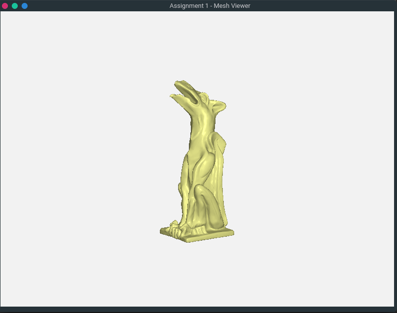

1. Mesh Loading: Load a mesh model saved as an OBJ file
2. Mesh Display: Render the mesh model with OpenGL
I created an objmodel.cpp file to read the fileLocation
```
model.LoadFile("../data/sphere.obj")
```

In the objmodel.cpp file, file is read line by line, and separated into vertex, vertex normal, and faces.

Vertex has the following format: ```"v %f %f %f"```<br>
Vertex normal has the following format: ```"vn %f %f %f"```<br>
Face has the following format: ```"f %d/%d/%d %d/%d/%d %d/%d/%d"```

At each line, we use sscanf to get the float (vertex and vertex normal) and unsigned integer (face).

For the vertex, I inserted into the verList directly with 6 values: ```v.x, v.y, v.z``` and 3 '0' value which will serve as the
corresponding ```vn.x, vn.y, vn.z``` values.

For the vertexNormal, I inserted the normal values as struct named normal, which can be found in objmodel.h. The struct
normal store ```vn.x, vn.y, vn.z```.

For the face, I inserted the faces values as struct named face, which can be also found in objmodel.h. The face struct 
stores these values
```
v1, vn1: a, c
v2, vn2: d, g
v3, vn3: h, j
```
where v1, vn1, v2, vn2, v3 and vn3 corresponds to index of the vertex (v) and vertexNormal (vn).

In the AddVertexData, we will update the corresponding verList with its vertexNormal values, using the face indices. We 
will also update the triList with the v index. We have to subtract 1 from the indices stored as obj format stores the face
values starting from index 1, instead of 0 based indices that we are working with.

https://stackoverflow.com/questions/4346556/loading-indices-from-wavefront-obj-format


3. Mesh Coloring: Change rendering color of the mesh model
For coloring, there 4 colors in the colorTable
```
glm::vec3 colorTable[4] = 
 {
    glm::vec3(0.6, 1.0, 0.6),
    glm::vec3(1.0, 0.6, 0.6),
    glm::vec3(0.6, 0.6, 1.0),
    glm::vec3(1.0, 1.0, 0.6) 
};
```
So we just need to edit the colorId to render a change in the shader:
```
glUniform3fv(glGetUniformLocation(myShader.ID, "meshColor"), 1, &colorTable[colorID][0]);
```




4. Mesh Transformation: Rotate, translate, and scale the mesh model
```
// render the loaded model
//glm::vec3 aColor = glm::vec3 (0.6f, 1.0f, 0.6f);
glUniformMatrix4fv(glGetUniformLocation(myShader.ID, "model"), 1, GL_FALSE, &modelMatrix[0][0]);
```
From this line of code in main.cpp, we can determine that the modelMatrix is the model that is attached to the shader, so
the transformation will be done on the modelMatrix.


