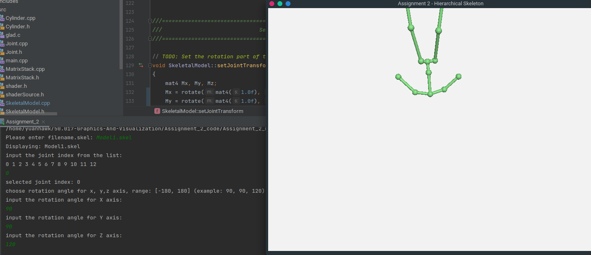

1. Load Skeleton File: 40%
```
        joint->transform = translate(mat4(1.0f), vec3 (x, y, z));
        m_joints.push_back(joint);
```
To get a translation matrix of each joint, we apply glm translation on the identity matrix to get joint's transformation
matrix. With the new joint, we update the m_joints with the newly created joint.

```
        if (j == -1) {
            m_rootJoint = joint;
        } else {
            m_joints[j]->children.push_back(joint);
        }
```
If ```j``` is -1, joint is set as root node, whereas if ```j``` > -1, of which joint is a child node, and we will push onto
the linked list at the corresponding position j.


2. Draw Skeleton: 40%
```
void SkeletalModel::computeJointTransforms(Joint* joint, MatrixStack matrixStack)
{
    matrixStack.push(transpose(joint->transform));
    ...
}
```
To render the joint transformation, we will use the matrixStack to store the transpose of the joint transformation matrix.

```
void MatrixStack::push( const glm::mat4& m )
{
	// Push m onto the stack.
	// Your stack should have OpenGL semantics:
	// the new top should be the old top multiplied by m
    
    //Doing multiplication
    glm::mat4 top = m * m_matrices.back();
    m_matrices.push_back(top);
}
```
Judging from the push function of the MatrixStack, we see that the new top (m) multiplies with the old top (m_matrices.back()),
so we are required to use the transpose of the top to get the same result as old top multiplied by m.

```
void SkeletalModel::computeJointTransforms(Joint* joint, MatrixStack matrixStack)
{
    ...
    for (auto & i : joint->children) {
        computeJointTransforms(i, matrixStack);
    }

    jointMatList.push_back(matrixStack.top());
    matrixStack.pop();
}
```
For every joint, we get its children and apply computeJointTransforms on the children as well, and when all the children
are transformed, we push the matrixStack onto the jointMatList for rendering.

We then pop the matrixStack top element from the stack.

```
void SkeletalModel::computeBoneTransforms(Joint* joint, MatrixStack matrixStack)
{
    matrixStack.push(transpose(joint->transform));

    for (auto & i : joint->children) {
        vec3 direction = i->transform[3];

        vec3 z_axis = normalize(direction);
        vec3 y_axis = normalize(cross(z_axis, vec3(0, 0, 1)));
        vec3 x_axis = normalize(cross(y_axis, z_axis));

        mat3 rotation(x_axis, y_axis, z_axis);
        mat4 T = translate(mat4(1.0f), vec3(0, 0, 0.5));
        mat4 S = scale(mat4(1.0f), vec3(0.01f, 0.01f, length(direction)));
        mat4 R = mat4(rotation);

        boneMatList.push_back(transpose(R * S * T) * matrixStack.top());

        computeBoneTransforms(i, matrixStack);
    }
    matrixStack.pop();
}
```
Similar to that computeJointTransform, we push the transpose of the joint transformation matrix. To get the direction, we
retrieve the last column to form the directional vector.

Since z = parentOffset.normalized(), the z-axis is retrieved from the normalized directional vector.
y = (𝑧 × 𝑟).normalized() and x = (𝑦 × 𝑧).normalized() are used to retrieve the y and x-axis respectively.

To get the final positional matrix of the bone, we do a multiplication of the rotational, scaling, and translation matrix
with the previous matrixStack positional matrix to get the new bone positional matrix.

Similarly to the computeJointTransforms function, we get the joint and apply computeBoneTransforms on the children as well,
and when all the bones are transformed, we push the matrixStack onto the boneMatList for rendering.

We then pop the matrixStack top element from the stack.


3. Change Pose of Skeleton: 20%
```
void SkeletalModel::setJointTransform(int jointIndex, float angleX, float angleY, float angleZ)
{
    mat4 Mx, My, Mz;
    Mx = rotate(mat4(1.0f), angleX, vec3(1, 0, 0));
    My = rotate(mat4(1.0f), angleY, vec3(0, 1, 0));
    Mz = rotate(mat4(1.0f), angleZ, vec3(0, 0, 1));

    Joint* joint = m_joints[jointIndex]; // defining pointer variable
    m_joints[jointIndex]->transform = joint->transform * Mz * My * Mx; // applying rotations
}
```
To set the joint transformation, we do a multiplication of the Mx, My, Mz matrices which represent the rotational matrix
in the x-axis, y-axis and z-axis respectively.

We then update the joint transformation matrix at the jointIndex with the new transformation matrix.

Output:

Fig.1 Model1.skel


Fig.2 Model2.skel


Fig.3 Model3.skel


Fig.4 Model4.skel