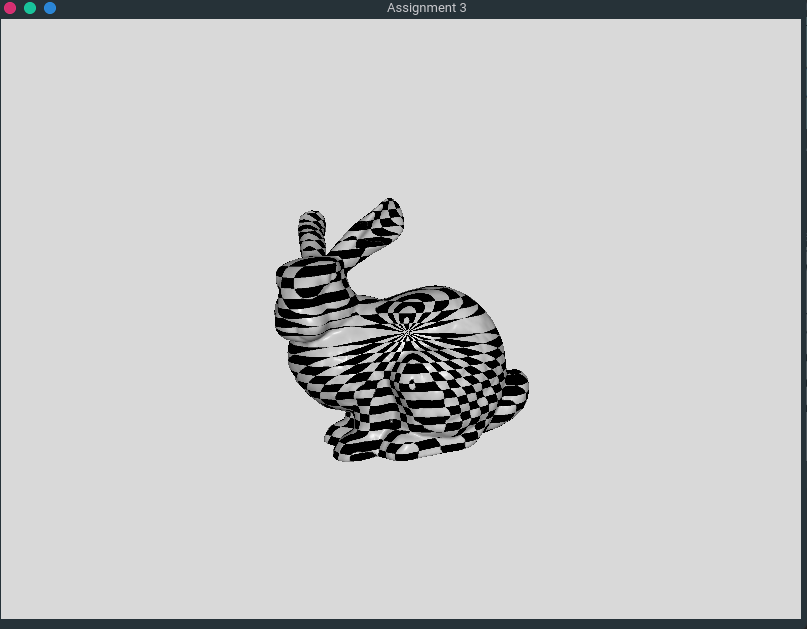

1. Planer Parameterization: 30%
```
   float W = myObject.bBox.maxP[0] - myObject.bBox.minP[0];
   float H = myObject.bBox.maxP[1] - myObject.bBox.minP[1];

   for (unsigned int i = 0; i < myObject.vertices.size(); i++)
   {
       myObject.vertices[i].t[0] = W * myObject.vertices[i].v[0]; // Wu
       myObject.vertices[i].t[1] = H * myObject.vertices[i].v[1]; // Hv
   }
```
Width of the bounding box is retrieved from the subtraction of the bounding box max and min, same for the Height as well.
We then multiply the width and vertex v[0], and the height with vertex v[1].

2. Cylindrical Parameterization: 30%<br>
<br>
With the formula we convert retrieve x, y, z, where<br>
x = r cos theta<br>
y = r sin theta<br>
z = h phi

3. Spherical Parameterization: 40%
<br>
x = rho cos theta sin phi<br>
y = rho sin theta sin phi<br>
z = rho cos phi

Output
<br>
Fig.1 bunny planar

<br>
Fig.2 bunny cylindrical

<br>
Fig.3 bunny spherical