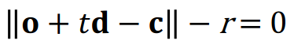
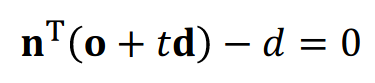
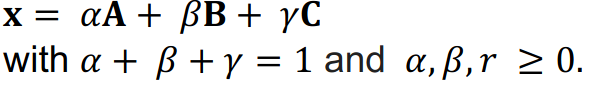
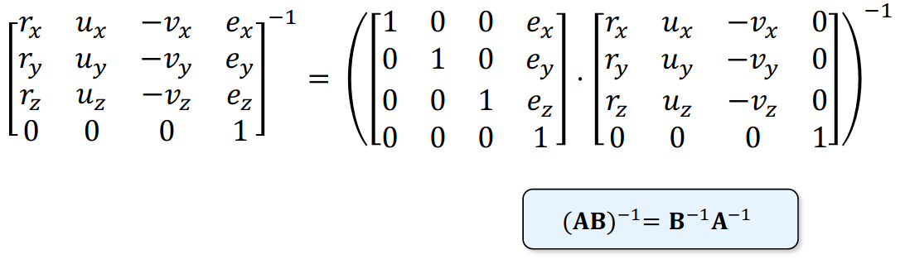
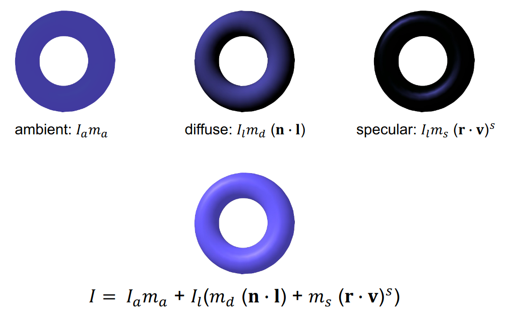

# Assignment_4


## For Mac

Download and install CMake for Mac OS: https://cmake.org/download/

Input the following commands on the Terminal: 
1. cd to the folder: `Assignment_4/build`
2. `cmake ..`
3. `make`
4. `./gen.sh`


1. Sphere<br>

Check the intersection using the above formula. If there is an intersection, discriminant ```D = b^2 - 4ac > 0```, and
we will return the intersection with the smallest t

2. Plane<br>

To check for the intersection, we have to check if the ray is parallel to the plane, which means that the dot product of
normal and the ray direction will be 0. If otherwise, we divide the sum of dot production of ray origin and the normal
divided by the dot product of normal and normalized ray direction.

3. Triangle<br>
Using the Barycentric matrices, we do a matrix division to get the alpha, beta and gamma.
If the barycentric coordinates fulfill the conditions:
<br>
and the t is within the range, we can return normal n and texture.

5. Transform<br>

To get the transformed ray, we use the inverse of the original coordinate and direction to generate a new ray. If the new
ray intersects, we return t as the transposed matrix multiplied by the normal.

6. Light Computations<br>

For the material, we separate the calculation into diffuse and specular lighting. We check for the validity of the texture
before returning the sum of diffuse and specular lighting from the given formula above.